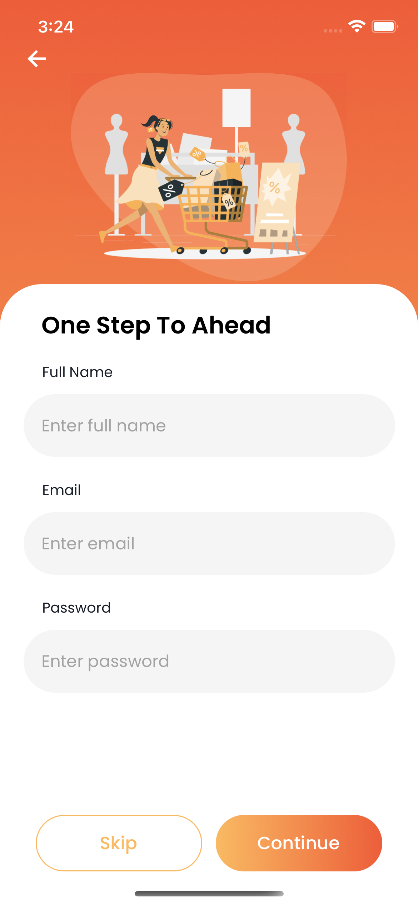
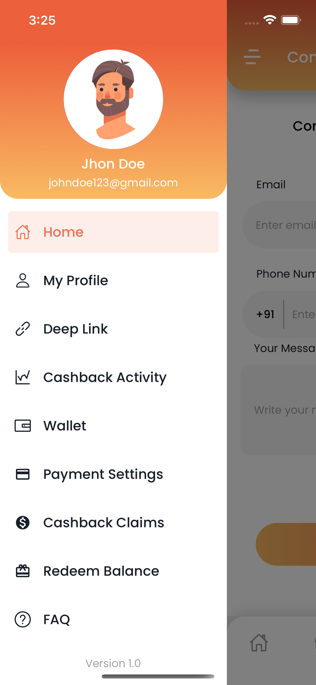
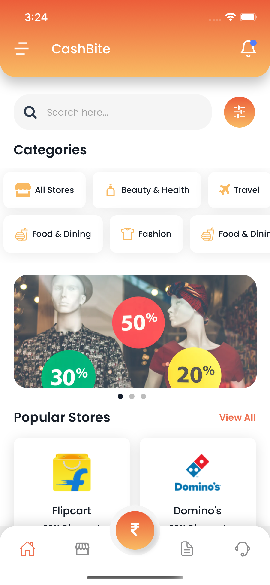
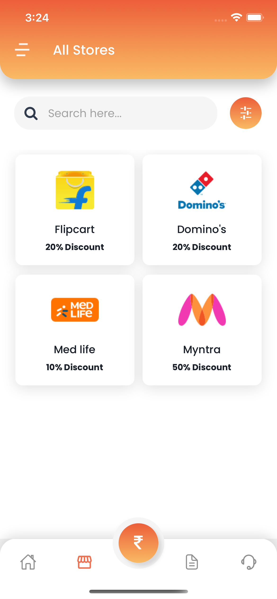
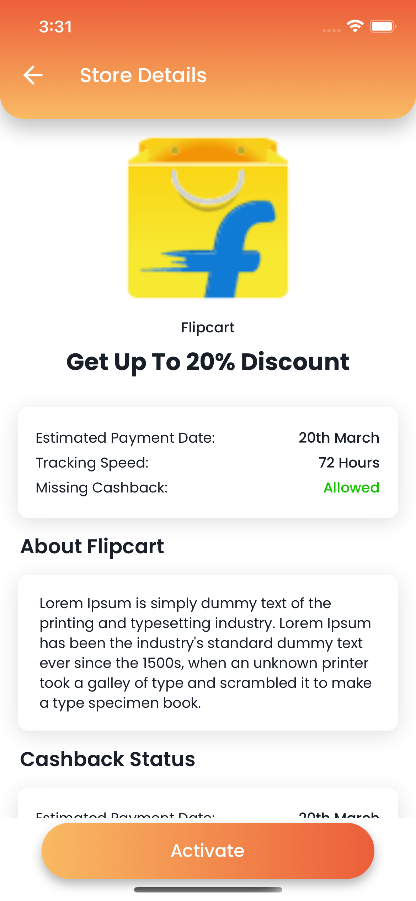

# Cashbite

## About The Project
Cashbite App is for the people who want to achieve the maximum cashback from their purchases. Main purpose of the app is to provide a one stop solution where all the discount coupons are gatherd for an individual product and the user can compare the coupons and apply them as per their needs.

## Built With
* React
* React Native CLI
* Redux
* JavaScript

## Prerequisites
* npm ~ 8.1.0
* xcode 13
* android studio (API Level 31, gradle 7.1.1)
* cocoa pods

## Installation
* Install libaries
```sh
yarn install
```
* Install pods
```sh
cd ios && pod install && cd ..
```

## Getting Started
* For android
```sh
npm run android
```
* For ios
```sh
npm run ios
```
**NOTE:** 
```
If facing any issue while running project, install specific versions of tools used, open the project in respective platform(xcode/android studio) and build.
```

## Screens

### 1. Login & SignUp Screen:
<div align="center" style="display: flex; align-items: center">


  </div>


### 2. OTP Screen:
<div align="center" style="display: flex; align-items: center">


  </div>

### 3. Onboarding Details:
<div align="center" style="display: flex; align-items: center">

  </div>

### 4. Homescreen:
<div align="center">
  <div style="display: flex; align-items: flex-start;">
      
    
   
    
  
  </div>
</div>

### 5. Store Screens:
<div align="center">
  <div style="display: flex; align-items: flex-start;">
    
     
  </div>
</div>

## And many more....

## Working Video

Watch Video Here: 
https://www.youtube.com/embed/C6NKlwbepZY


## Contributions
1. Clone the Repository
2. Create your Feature Branch (`git switch -c feature/AmazingFeature`)
3. Add your changes (`git add .`)
4. Commit your Changes (`git commit -m 'Add some AmazingFeature'`)
5. Push to the Branch (`git push origin feature/AmazingFeature`)
6. Open a Pull Request & tag your reviewers
7. Don't forget to message your reviewers
